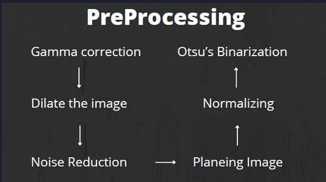
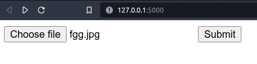
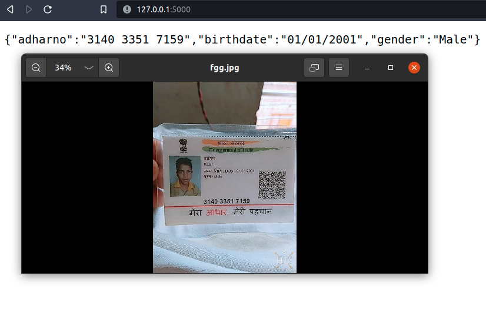
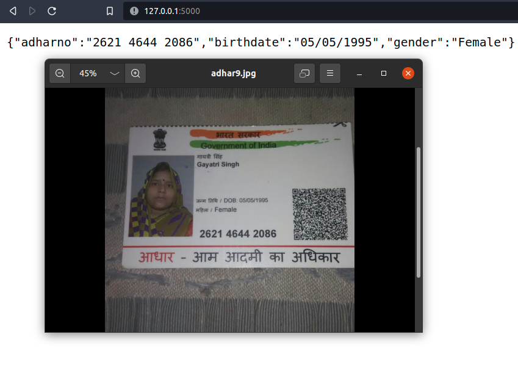
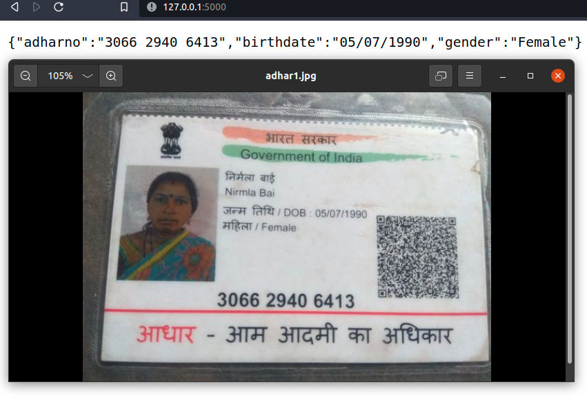

# []() []() []()
# OCR my Aadhaar
Using TesseractOcr and OpenCv this project can sucessfull extract adharnumber, Dateofbirth and gender from any version of aadhaar 

## Features

- Extract data from adharcard 
1) Date of Birth
2) Aadhar Number
3) Gender

## Preprocessing Steps


# Upload page


# Test Result 








## Deployment

To Install all the Dependencies required for the Project

```bash
  pip install -r requirements.txt
```

Run the Project

```bash
  flask run
```

## Lessons Learned
There is no libaray of function or image preprossing step that can work on all the image 

## References
1. https://flask.palletsprojects.com/en/2.2.x/ Flask
2. https://docs.python.org/3/library/re.html Regex
3. https://tesseract-ocr.github.io/ Tesseract
